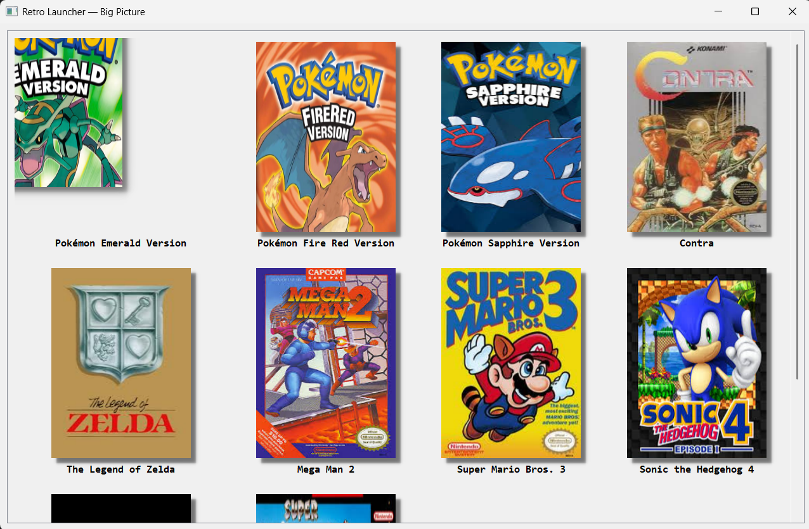

# 🎮 Retro Launcher – Big Picture Edition

> A modern **Steam Big Picture–style retro game launcher** built with **Python** and **PyQt5**.  
> Automatically detects your ROMs, fetches cover art, and launches the correct emulator — all through a smooth, animated interface.

---

## ✨ Features

✅ Steam Big Picture–style UI  
✅ Asynchronous image downloading (non-blocking)  
✅ Multi-emulator support (NES, SNES, GBA)  
✅ Internet cover art (RAWG API)  
✅ Animated focus transitions  
✅ Configurable themes & layout  
✅ Auto-caching for fast reloading  
✅ Ready for controller input (future extension)  

---

## 🖼️ Preview

*(Replace this with your screenshots later)*  


---

## 📂 Project Structure

```bash
retro_launcher_bigpicture/
│
├── main.py                  # Entry point
├── config.py                # Loads and saves configuration
├── games.py                 # Scans ROMs or loads games.json
├── images.py                # Downloads and caches cover art
├── launcher.py              # Emulator launch logic
├── ui_bigpicture.py         # GUI with Big Picture layout and animations
│
├── config.json              # User configuration (paths, emulators, theme)
│
├── data/
│   └── games.json           # Optional preloaded metadata
│
├── emulators/               # Your emulator executables
│   ├── nestopia.exe
│   ├── snes9x.exe
│   └── visualboyadvance.exe
│
├── roms/                    # Game ROMs organized by console
│   ├── NES/
│   ├── SNES/
│   └── GBA/
│
├── resources/
│   └── covers/              # Cached cover images
│
├── requirements.txt
└── README.md
⚙️ Requirements
Library	Purpose
PyQt5	GUI framework
requests	Internet cover downloads
Pillow	Image processing
pygame	(optional) controller support

Install dependencies
bash
Copy code
pip install -r requirements.txt
🚀 Setup & Installation
Clone the repository

bash
Copy code
git clone https://github.com/yourusername/retro-launcher-bigpicture.git
cd retro-launcher-bigpicture
Create and activate a virtual environment

bash
Copy code
python -m venv .venv
.venv\Scripts\activate     # on Windows
source .venv/bin/activate  # on Linux/Mac
Install dependencies

bash
Copy code
pip install -r requirements.txt
Add emulators
Place your emulators in the emulators/ folder:

Copy code
emulators/
├── nestopia.exe
├── snes9x.exe
└── visualboyadvance.exe
Add ROMs

markdown
Copy code
roms/
├── NES/
│   ├── Super_Mario_Bros_3.nes
│   └── Contra.nes
├── SNES/
│   ├── Super_Mario_Kart.smc
│   └── Street_Fighter_II.sfc
└── GBA/
    ├── Pokemon_Emerald.gba
    ├── Pokemon_FireRed.gba
Set up your RAWG API key

Visit RAWG.io API Docs

Create a free account → get your key.

Add it to config.json:

json
Copy code
"rawg_api_key": "YOUR_RAWG_KEY"
Run the launcher

bash
Copy code
python main.py
🧠 How It Works
File	Responsibility
main.py	Entry point – starts the PyQt5 app
config.py	Loads and saves emulator paths, themes, and keys
games.py	Scans ROMs or loads metadata from JSON
images.py	Downloads cover art asynchronously using requests
launcher.py	Launches emulators and watches for process exit
ui_bigpicture.py	Displays the interactive Big Picture interface

📊 Data Flow
text
Copy code
main.py
  ├── load_config()
  ├── scan_roms()
  │     └── games.json / roms/
  ├── ImageFetcher (downloads covers)
  ├── UI updates asynchronously
  └── On click → find_emulator() → launch_and_watch()
⚙️ config.json Example
json
Copy code
{
  "emulators": {
    "NES": "emulators/nestopia.exe",
    "SNES": "emulators/snes9x.exe",
    "GBA": "emulators/visualboyadvance.exe"
  },
  "roms_dir": "roms",
  "covers_dir": "resources/covers",
  "recent_file": "recent.json",
  "playtime_file": "playtime.json",
  "themes": ["retro", "crt", "dark"],
  "ui_theme": "crt",
  "favorites": [],
  "rawg_api_key": "YOUR_RAWG_KEY"
}
💾 games.json Example
json
Copy code
[
  {
    "key": "NES::Super Mario Bros 3",
    "name": "Super Mario Bros 3",
    "console": "NES",
    "file": "Super_Mario_Bros_3.nes",
    "rom_path": "roms/NES/Super_Mario_Bros_3.nes",
    "image_url": "https://images.igdb.com/igdb/image/upload/t_cover_big/co1wyy.png"
  },
  {
    "key": "GBA::Pokemon Emerald Version",
    "name": "Pokémon Emerald Version",
    "console": "GBA",
    "file": "Pokemon_-_Emerald_Version.gba",
    "rom_path": "roms/GBA/Pokemon_-_Emerald_Version.gba",
    "image_url": "https://images.igdb.com/igdb/image/upload/t_cover_big/co1xnn.png"
  }
]
📚 Libraries Used
Library	Purpose
PyQt5	Builds the GUI and animations
requests	Fetches cover images & RAWG data
Pillow	(Optional) For image optimization
subprocess	Launches emulator processes
threading	Runs image downloads in background
json	Manages configuration and metadata
os	Handles file system operations

💡 Future Enhancements
🎮 Controller/joystick support

🧭 Search and filter by title

🕒 Per-game playtime tracking

⭐ Favorite system

🧱 Themes: CRT, neon, dark

🧑‍💻 Contributing
Pull requests are welcome!

Fork the repo

Create a branch (feature-controller-support)

Commit your changes

Open a Pull Request 🚀

📜 License
This project is licensed under the MIT License — free for personal and commercial use.
Please credit the original author when using or modifying it.

💖 Credits
Developed by [Md Huzaifa]
Inspired by Steam Big Picture & RetroArch
Covers and metadata powered by RAWG.io and IGDB

yaml
Copy code

---

✅ **Summary**

You now have:
- `.gitignore` → keeps your repo clean  
- `README.md` → professional GitHub-ready documentation  

You can now initialize your repo:
```bash
git init
git add .
git commit -m "Initial commit - Retro Launcher Big Picture Edition"